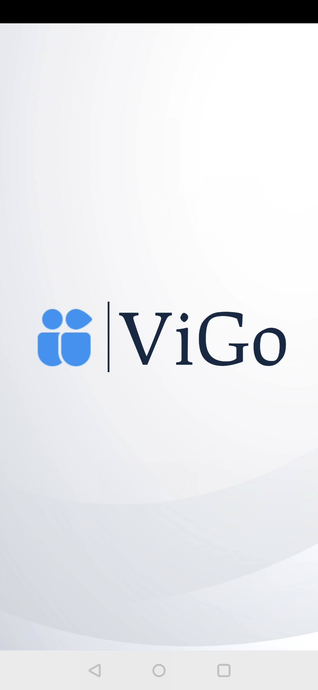

# ViGo!

## Overview

**ViGo** is a video conferencing and meeting schedule mainainance *Android Mobile application*.

## Tech Stack & Open Source Libraries
* **Minimum Android SDK level 23**

* **[Agora SDK for Android](https://docs.agora.io/en/Video/downloads?platform=Android)** - Agora Video Call enables easy and convenient one-to-one or one-to-many calls and supports voice-only and video modes with the Agora RTC SDK.

* **Agora Token Generator Library** - Agora provides an open-source [AgoraDynamicKey](https://github.com/AgoraIO/Tools/tree/master/DynamicKey/AgoraDynamicKey) repository on GitHub, which enables you to generate tokens with programming languages such as C++, Java, and Go.

* **[ Room persistance library ](https://developer.android.com/training/data-storage/room)** - The Room persistence library provides an abstraction layer over SQLite to allow fluent database access while harnessing the full power of SQLite.

## UI

     
     
## Download

To download the app click [here](https://drive.google.com/drive/folders/1wsXNsNBTWO4f9JTdqdE8hj-SoK34wWMK?usp=sharing) and follow the steps-
1. Download The JSON file
2. Download the APK file
3. Go to **Install packages** in File Manager of your android device and click on **app-debug.apk** and allow it to install.

## References

* [Agora Documentation](https://docs.agora.io/en/Video/API%20Reference/java/index.html)

